Usage:
======
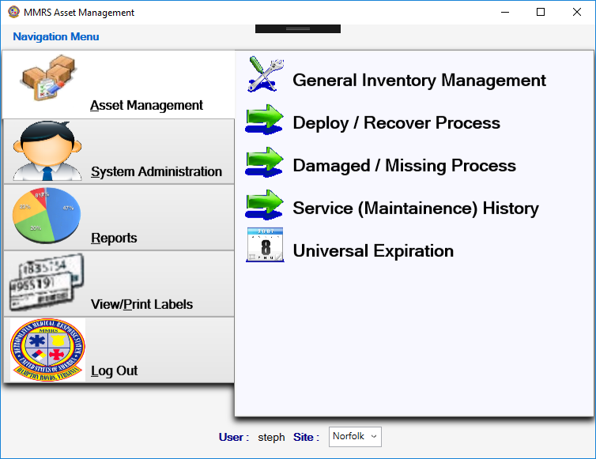

After logging in, the main menu is displayed.  Depending on if
user had administrative rights or not will determine which
choices are available.

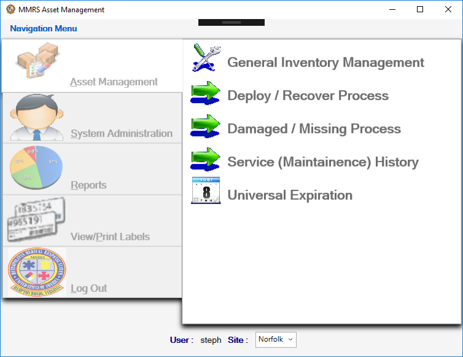

Note that after successful login, if the data is still loading 
then the main menu will be disabled until the loading completes.

## Asset Management:

### General Inventory Management
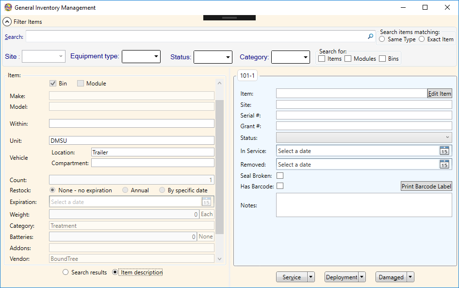

This is where most of the inventory adjustments are made.
Including updating counts, deploying, replacing, etc.
A search widget is provided to find a specific item or modules,
and then various actions can be taken by selecting specific
items from the resulting tree of items and corresponding button.

If logged in as an administrator additional actions are 
available to add new items to be tracked.

### Deploy / Recover Process
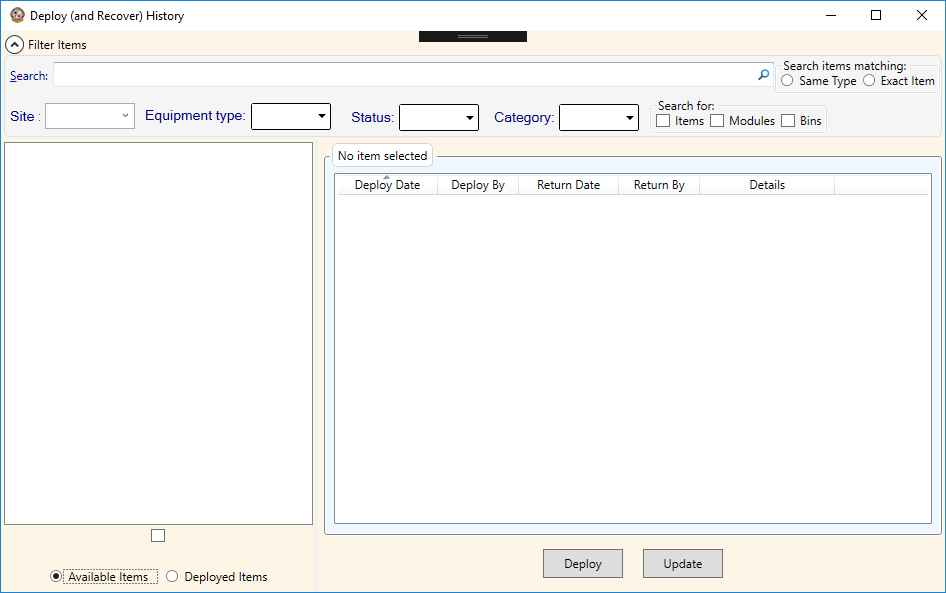

This is where an overview of all deployed items can be viewed.
Additionally, it provides a convenient interface to recover
deployed items; return to inventory, replace, send for repair
as needed.

### Damaged / Missing Process
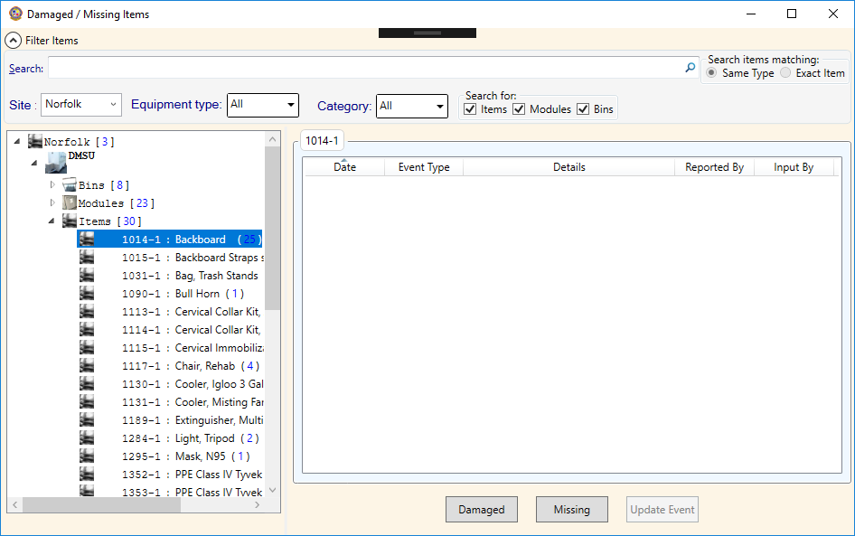

This is where items that have gone missing or damaged may
be reported and fixed or replaced.

### Service (Maintenance) History
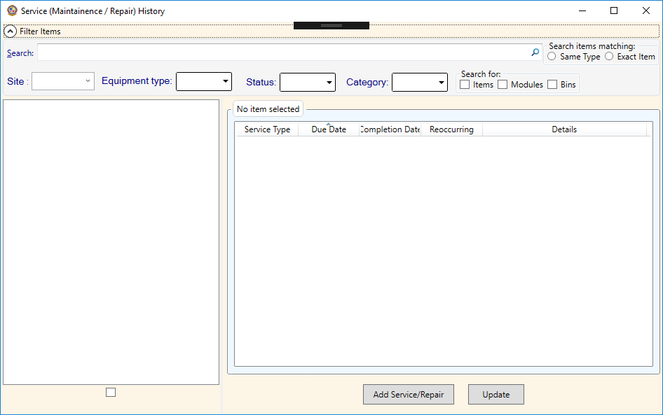

This is where an overview of all maintenance requests can
be created, updated, and reviewed.

### Universal Expiration
This is where an overview of items expiration information 
may be reviewed and expiring items updated as replaced.

## System Administration:
Only available if logged in as an administrator.

### Manage Users
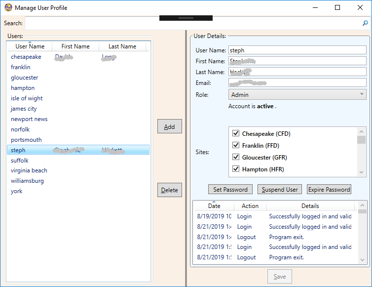

An administrator can add new users and edit existing users.
Users can be assigned to specific sites, where they will be
limited to making changes to only those sites.

### Replicate Database
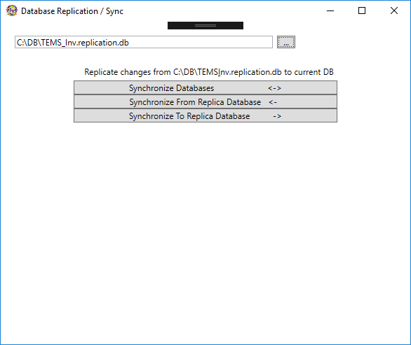

The data file (database) may be replicated [synchronized]
with any other location via this window.  

Currently only off-line replication is possible.  Usually 
two-way synchronization will be used so all changes from main 
site and remote sites are replicated to each other, however,
one-way synchronization is also possible to only push 
(or pull) changes.  Note: both remote and local data file
must be available, such as on a share drive, USB flash drive
or for one-way (or to send an updated copy back) via email, etc.
This mode allows updating from various locations as needed
without requiring Internet access.

A future revision will include on-line replication with a
central server.  This will allow updates to be done in
near real-time, but will require Internet access.

### Manage Vendors
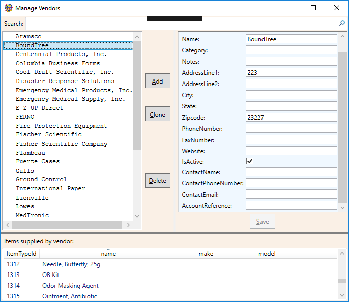

From here, administrators can update information about existing 
vendors or add new vendors.  Although vendors may be deleted
from here, caution should be taken to ensure there are no
items linked to the vendor prior to deletion.

### Manage Site of Equipment

### Manage Items
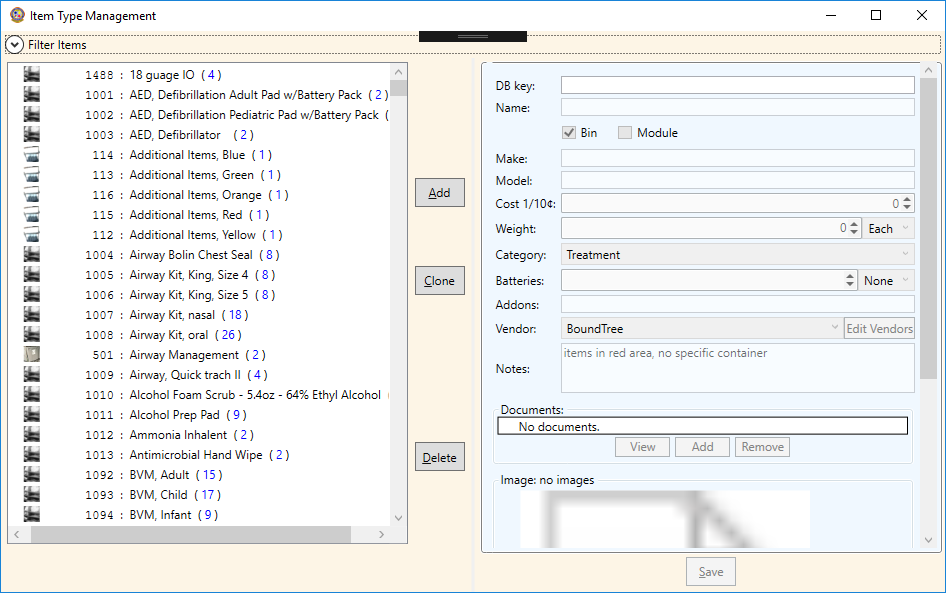
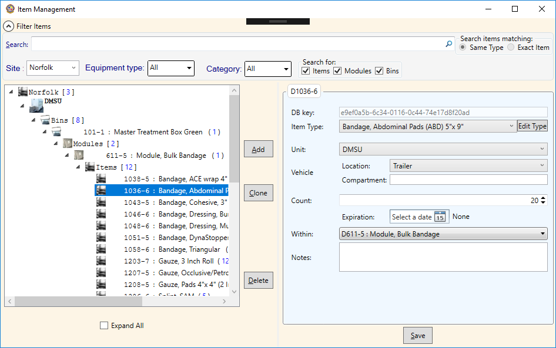

From here, administrators can add or update the items
available and where they are on the trailers.  Changes 
here will effect trailers at all sites.  When adding
an item to a trailer, an existing ItemType should be used
if the item is the same as others already used.  However,
if the item is similar but should be treated as a distinct
type for replacement/maintenance purposes (not simply a
unique serial # or similar but actually a different type
such as with feature x vs without) then a new ItemType
should be created first.

### Edit Reference Data
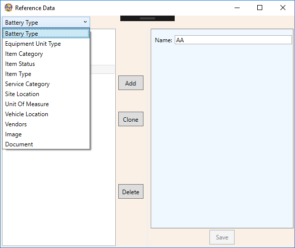

The information here will generally not change.  This is
various pieces of reference information linked to various
items such as battery types, units of measure, etc.  This
window allows editing of data within auxiliary tables.

## Reports:
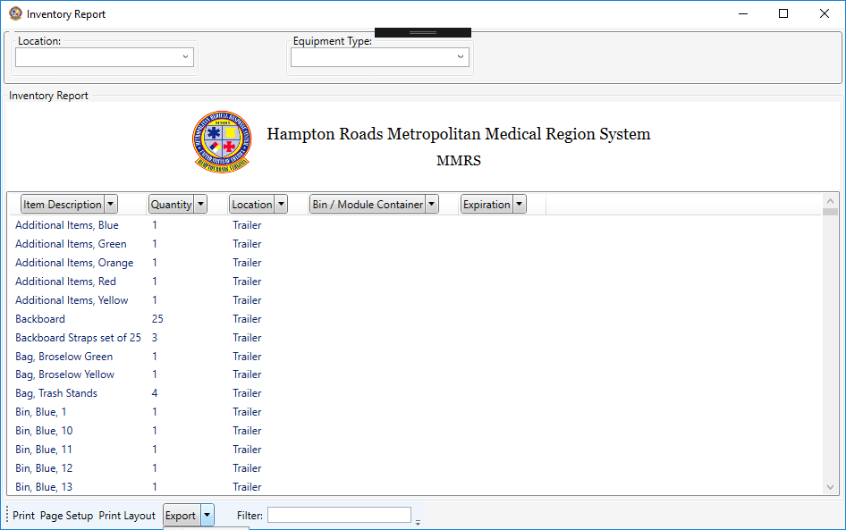

### Inventory Report

### Item Status Report

### Vendor / Cost Report

### Weight Report

### Expiration Report

### Service Report

### Deployment Report

### Damaged / Missing Report

## View / Print Lables:

### View and Print Lables
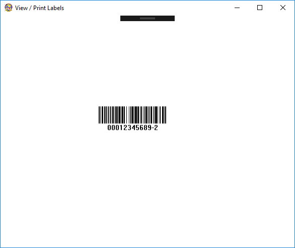

## Login and Logout:
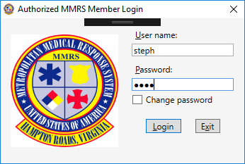

User information is stored in the same database.  Only an administrator
can add or edit users, however, every user can update their own password.
On login there is the option to change password before continuing (this
assumes a successful login).  Passwords are not stored in plain text,
they are salted and hashed using an appropriate cryptographic hashing
algorithm.  However !!! do not reuse passwords for other sites/applications.

## Miscellaneous:

### Installation
Current program is a .Net WPF application targeting Net Framework 4.0
written in C# version 7.  The application is tested to run on
Windows XP, Windows 7, and Windows 10.  Untested, but should also
run on Windows Vista and Windows 8/8.1.  Future versions will
be updated to target at least Net Framework 4.6 (Net Standard 1.x),
possibly latest Net Standard and Net Core 3; allowing easier
cross platform support but dropping Windows XP and Vista support.

The application is distributed via a ClickOnce installer.  Simply 
run the installer and it will correctly install the application for
the current user.  An initial copy of the database must then be
manually copied to C:\DB\TEMS_Inv.db (or other location).  If the
database is installed (or moved) to a non-standard location then on
startup the application will prompt for database location [this is
then stored for future startups to avoid asking each time].  When the
application is started it will first check for any updates and provide
and opportunity to update the application prior to running.  No changes
to the database should be needed on updates.

---------
June 2019
